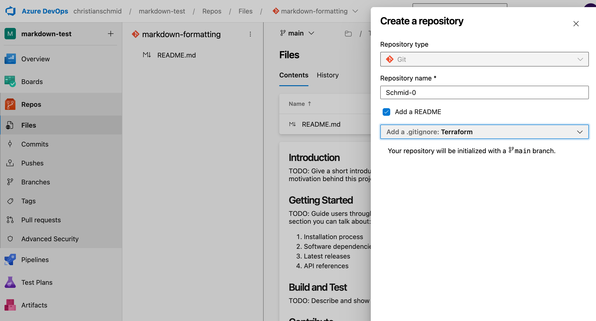
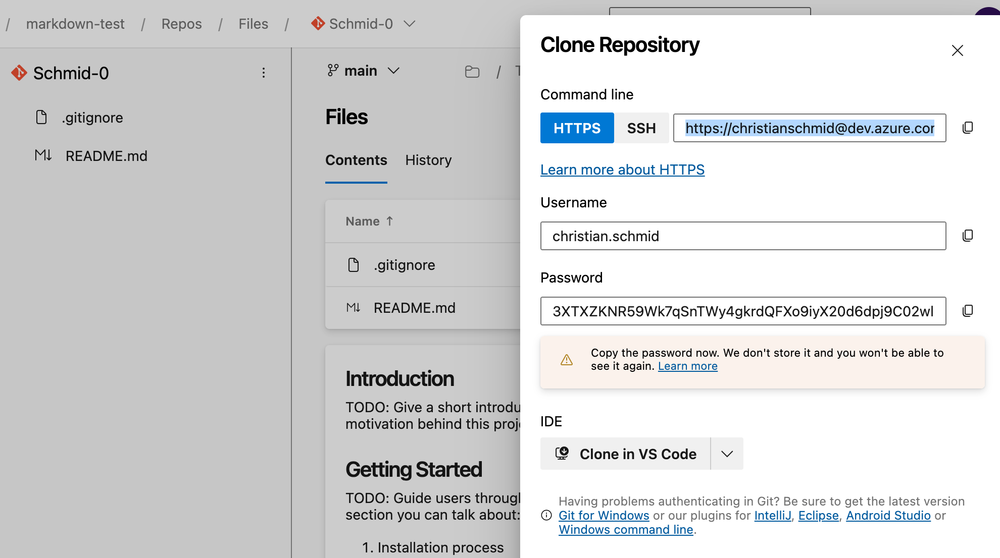
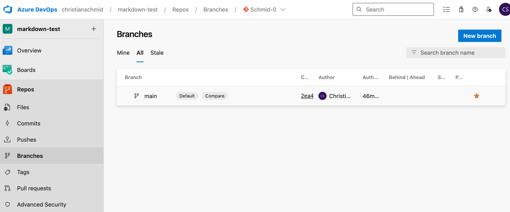
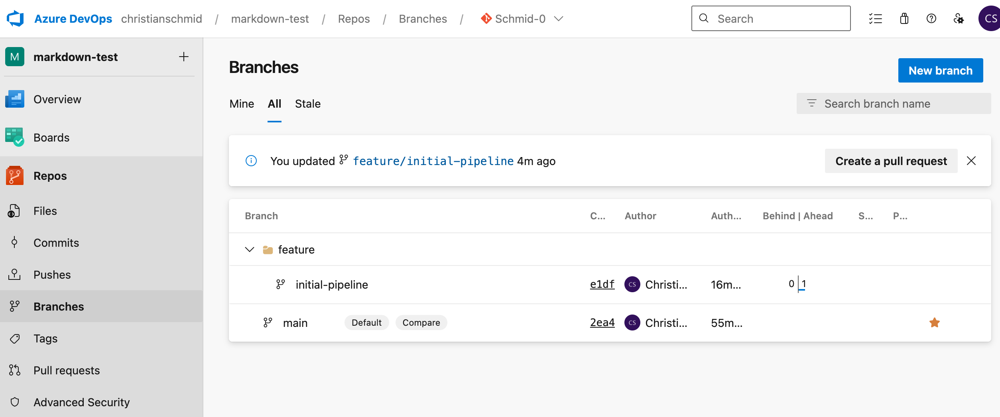
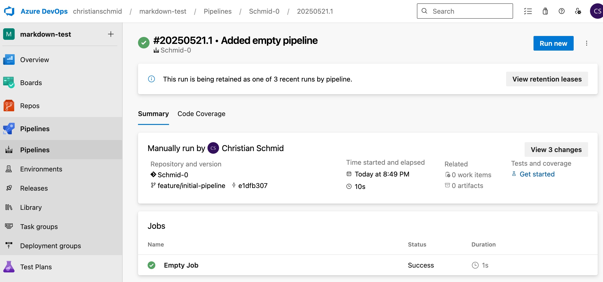
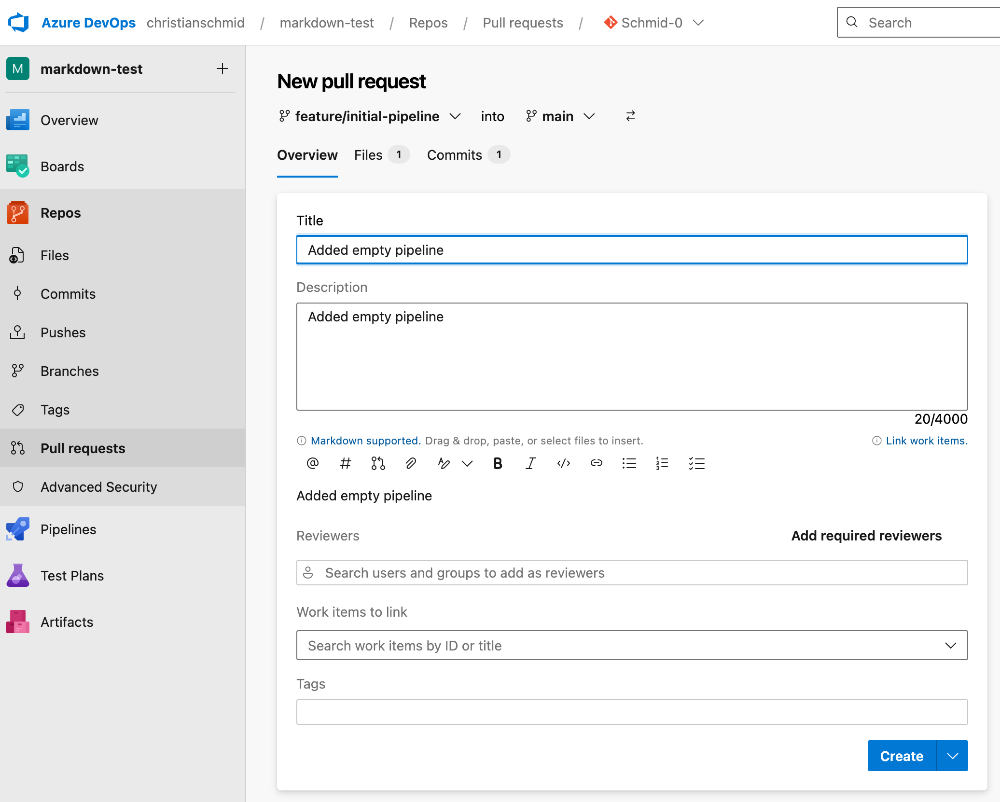
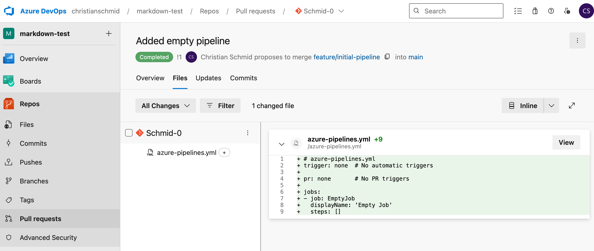

# Terraform Schulung - Aufgabe 09

Nun liegt der Fokus auf Azure DevOps und dem Development Workflow. In dieser Übung werden die Grundlage für den Einsatz von Pull Request (PR) und Deployment via CI/CD-Pipelines gelegt.

Folgende Ziele sind in dieser Aufgabe zu erreichen:

1. Erstellung eines neuen Repository in [Azure DevOps](https://dev.azure.com/helsana/CLOUDFOUNDATIONNETWORKING)
2. Klonen des Repository und Erstellung eines Feature-Branch
3. Erstellung und Ausführung einer leeren Pipeline
4. Erstellung PR und Merge in Main-Branch

Das Resultat dieser Aufgabe wird für die Aufgaben 10 und 11 verwendet.

## Schritt 01 - Repository erstellen

Das Repository wird manuell via Azure DevOps ertellt.

1. Im Browser das Azure DevOps Projekt [CLOUDFOUNDATIONNETWORKING](https://dev.azure.com/helsana/CLOUDFOUNDATIONNETWORKING) aufrufen
2. Wenn die Anmeldung abgelaufen ist, mit dem HA-Account sich erneut anmelden
3. In der linken Menüleiste den Menüpunkt *Repos* auswählen
4. In der Dropdownlisten (oben in der Mitte) *New Repository* auswählen
5. Den Repository Name eindeutig und wiedererkennend setzen (z. B. \<Nachname\>-\<Arbeitsplatznummer\>)
6. *Add a README* aktiviert lassen
7. Bei *Add a .gitignore* Terraform auswählen
8. Repository erstellen

<details>
<summary>Lösungshinweis</summary>


</details>
<br>

## Schritt 02 - Repository klonen

Das erstellte Repository ist durch die Erstellung der README- und .gitignore-Datei nicht leer. Um mit dem Repository arbeiten zu können, wird es geklont. Dafür verwenden wir den Befehl `git clone`. 

An der Stelle, wo `git clone` ausgeführt wird, wird das Repository erstellt. Deshalb vor dem Klonen in PowerShell zum Desktop oder *workspace*-Ordner wechseln. Führt `cd ~/Desktop` oder `cd ~/Desktop/workspace` aus. Für das Klonen wird *HTTPS* verwendet. 

1. Wählt *HTTPS* bei *Command line* aus und kopiert die URL
2. Generiert mit Klick auf *Generate Git Credentials* das Passwort
3. Schreibt in PowerShell `git clone ` und fügt die kopierte URL ein
4. Bestätigt den Clone-Befehl
5. Wenn ihr aufgefordert werden, kopiert und fügt das *Password* in PowerShell ein

Auf dem Desktop resp. im *workspace*-Ordner wurde ein Ordner mit dem Namen des Repository erstellt. Wechselt mit `cd <Repository>` in diesen Ordner. Der Ordner beinhaltet zwei Dateien:
- .gitignore
- README.md

<details>
<summary>Lösungshinweis</summary>


</details>
<br>

## Schritt 03 - Feature-Branch erstellen

Bevor ein Feature-Branch erstellt wird, wird geprüft, welcher Branch aktuell ausgewählt ist. Mittels `git status` wird der Branchname und offene Änderungen angezeigt. Da noch nichts geändert wurde, sollte der Output folgendermassen aussehen:

```bash
On branch main
Your branch is up to date with 'origin/main'.

nothing to commit, working tree clean
```

Normalerweise wird ein Feature-Branch mit dem Präfix `feature/` im Namen gekennzeichnet. Dies kann aber von Team oder Unternehmung unterschiedlich gehandhabt werden. Wenn mit dem Präfix `feature/` für neue Features gearbeitet wird, wird höchstwahrscheinlich Branches für die Fehlerbehebung mit dem Präfix `bug/` gekennzeichnet.

In dieser Aufgabe wird der Präfix `feature/` verwendet. Erstellt ein Feature-Branch mit dem Namen `feature/initial-pipeline`.

<details>
<summary>Lösungshinweis</summary>

Der Befehl für die Branch-Erstellung lautet `git checkout -b feature/initial-pipeline`.

</details>
<br>

Die Ausgabe in PowerShell nach der Feature-Brancherstellung sieht folgendermassen aus:

```bash
Switched to a new branch 'feature/initial-pipeline'
```

## Schritt 04 - Leere Pipeline erstellen

Das Ziel ist eine leere Pipeline, die in Azure DevOps manuell ausgeführt werden kann. Eine Pipeline ist in YAML geschrieben.

In PowerShell sollte nach wie vor der Repository-Ordner geöffnet sein. Mit `code .` wird VS Code geöffnet und die (leere) Pipeline-Erstellung startet.

1. Erstellt eine neue YAML-Datei mit dem Namen `azure-pipelines.yml`
2. Definiert einen leeren Job mit dem *displayName* *Emptry Job*

<details>
<summary>Lösungshinweis</summary>

```YAML
# azure-pipelines.yml
trigger: none  # No automatic triggers

pr: none       # No PR triggers

jobs:
- job: EmptyJob
  displayName: 'Empty Job'
  steps: []
```

</details>
<br>

## Schritt 05 - Änderungen committen

Die Pipeline kann lokal nicht getestet werden. Deshalb wird die Änderung Git hinzugefügt, committed und gepusht. Zuerst wird geprüft was `git status` ausgibt.

```bash
On branch feature/initial-pipeline
Untracked files:
  (use "git add <file>..." to include in what will be committed)
	azure-pipelines.yml

nothing added to commit but untracked files present (use "git add" to track)
```

**git add**

Der Status sagt, dass eine Datei "untracked" und das "nothing added to commit" ist. Das ist korrekt, da die Datei `azure-pipelines.yml` noch nicht Git hinzugefügt wurde. Mittels `git add .` werden alle Dateien in diesem Ordner (`.`) Git hinzugefügt. Nachdem `git add .` ausgeführt wurde, wird nochmals `git status` geprüft. Nun wartet eine Datei auf den Commit.

```bash
On branch feature/initial-pipeline
Changes to be committed:
  (use "git restore --staged <file>..." to unstage)
	new file:   azure-pipelines.yml
```

**git commit**

Ein Commit benötigt einen sprechenden Kommentar. Dieser wird in der Commit-History angezeigt. In diesem Fall ist "Added empty pipeline" perfekt. Mit `git commit -m "Added empty pipeline"` wird die Änderung committed. Der Output stimmt mit den Änderungen überein: 1 Datei wurde geändert.

```bash
[feature/initial-pipeline e1dfb30] Added empty pipeline
 1 file changed, 9 insertions(+)
 create mode 100644 azure-pipelines.yml
```

Auch wenn die Änderungen committed sind, sind sie nach wie vor lokal und noch nicht am ursprünglichen - *origin* - Ort. Wenn nicht mehr bekannt ist, was eigentlich der ursprüngliche Ort ist, kann mit `git remote -v` dieser angezeigt werden. Das sieht dann, abhängig der Azure DevOps Organisation und Repository, folgendermassen aus:

```bash
origin	https://christianschmid@dev.azure.com/christianschmid/markdown-test/_git/Schmid-0 (fetch)
origin	https://christianschmid@dev.azure.com/christianschmid/markdown-test/_git/Schmid-0 (push)
```

**git push**

Bevor der Branch `` gepusht wird, wird geprüft, dass dieser noch nicht in Azure DevOps existiert. Wenn das Repository ausgewählt ist, kann auf der linken Seite der Menüpunkt *Branches* ausgewählt werden. In der ersten Übersicht werden alle eigenen Branches aufgelistet. Unter *all* auch Branches, die jemand anderes erstellt hat. In unserem Fall wird in beiden Listen nur *main* angezeigt.

<details>
<summary>Lösungshinweis</summary>


</details>
<br>

Nun wird die Änderung zum *Origin* gepusht. Mit `git push origin` wird im Repository ein neuer Branch erstellt. Der erste Push kann mit folgender Meldung beantwortet werden:

```bash
fatal: The current branch feature/initial-pipeline has no upstream branch.
To push the current branch and set the remote as upstream, use

    git push --set-upstream origin feature/initial-pipeline

To have this happen automatically for branches without a tracking
upstream, see 'push.autoSetupRemote' in 'git help config'.
```

Die Lösung ist bereits in der Fehlermeldung: `git push --set-upstream origin feature/initial-pipeline` ausführen. Nun wird der Push bestätigt:

```bash
(...)
To https://dev.azure.com/christianschmid/markdown-test/_git/Schmid-0
 * [new branch]      feature/initial-pipeline -> feature/initial-pipeline
branch 'feature/initial-pipeline' set up to track 'origin/feature/initial-pipeline'.
```

Nach dem Push werden in Azure DevOps zwei Branches dargestellt. Auch der Hinweis auf die Erstellung eines Pull Requests ist neu. Dieser ignorieren wir zum jetzigen Zeitpunkt. Wir möchten die Pipeline konfigurieren und ausführen.

<details>
<summary>Lösungshinweis</summary>


</details>
<br>

## Schritt 06 - Pipeline konfigurieren

Nur weil wir eine `azure-pipelines.yml` Datei erstellt haben, existiert noch keine Pipeline in unserem Repository in Azure DevOps. Folgende manuellen Schritte sind notwendig für die Pipeline-Konfiguration:

1. Im Repository den Menüpunkt *Pipelines* auswählen
2. Auf *Create Pipeline* klicken
3. Die Frage *Where is your code?* mit *Azure Repos Git* beantworten
4. Euer Repository in der Liste auswählen
5. Da wir bereits eine YAML-Datei in einem Branch haben, wählen wir *Existing Azure Pipelines YAML file* aus
6. Beim *Branch* selektieren wir `feature/initial-pipeline` und beim *Path* `/azure-pipelines.yml`
7. Mit Klick auf *Run* führen wir die Pipeline aus.

<details>
<summary>Lösungshinweis</summary>


</details>
<br>

Der *Run* läuft relativ schnell durch (Duration). Bis die Ausführung startet (Time started and elapsed), kann es ein wenig dauern, da wir uns die *Agents*, welche die Pipeline ausführen, teilen.

Auf jeden Fall besitzt das Repository eine (leere) Pipeline. Auf dieser bauen wir auf.

## Schritt 07 - Pull Request

Im Schritt 05 wurde der Hinweis auf die Erstellung eines Pull Requests noch ignoriert. Um diese Aufgabe abzuschliessen, möchten wir unseren Feature-Branch `feature/initial-pipeline` in den Branch `main` mergen.

**Branch Policy**

Theoretisch hätten wir die Datei `azure-pipelines.yml` auch gleich im Main-Branch erstellen und committen können. Normalerweise verhindert eine *Branch Policy* unter anderem den direkten Commit oder Merge in den Main-Branch. Nach *Best Practice* erfolgt der Merge von Änderungen immer via Pull Request (PR).

In unserem Playground-Setup hat auch der Merge via PR schwächen: Es gibt keine Mindestanforderungen an die Anzahl Approvers. Das bedeutet, jede:r kann seine/ihre PRs selbst bestätigen und in den Main-Branch mergen. Auch dies wird normalerweise mit einer *Branch Policy* verhindert.

**PR erstellen**

Trotzdem wird ein PR erstellt:

1. Im Repository im Menüpunkt *Pull requests* wird unser letzter Commit angezeigt:

```
You updated feature/initial-pipeline 35m ago
```

2. Mit Klick auf *Create a pull request* öffnet sich die PR-Übersicht
3. Wenn nur ein Commit vorhanden ist, wird dieser automatisch als Titel verwenden. Ansonsten einen sprechenden Titel eingeben.
4. Die *Description*, *Reviewers*, *Work items to link* und *Tags* bleiben leer

<details>
<summary>Lösungshinweis</summary>


</details>
<br>

**PR approven**

Wenn der PR gut ist, kann dieser *Approved* werden. Anschliessend wird mit Klick auf *Complete* der PR in den Main-Branch gemergt und geschlossen. Bevor der PR geschlossen wird, gibt es noch zwei wichtige Einstellungen:

1. *Merge type* definiert, welche Merge Strategie angewendet wird. *Merge (no fast forwards)* führt dazu, dass alle Commits im Feature-Branch auf dem Main-Branch sichtbar sind. Das kann bei sehr vielen Commits zu Unschönheiten führen. *Squash commit* adressiert diese Problematik, indem alle Feature-Branch-Commits zu genau einem *quetschten* Commit auf dem Main-Branch führt. Die Merge Strategie wird innerhalb eines Teams definiert. Wir verwenden *Squash commit*.
2. Aktiviert, dass der Feature-Branch nach dem Mergen gelöscht wird (*Delete feature/initial-pipeline after merging*). So bleiben keine Feature-Branch-Leichen übrig.

Jetzt wird mit *Complete merge* die Änderungen in den Main-Branch gemergt, PR geschlossen und Featurte-Branch gelöscht.

<details>
<summary>Lösungshinweis</summary>


</details>
<br>

Weitere Informationen:
- [Branch policies and settings](https://learn.microsoft.com/en-us/azure/devops/repos/git/branch-policies)
- [Merge strategies and squash merge](https://learn.microsoft.com/en-us/azure/devops/repos/git/merging-with-squash)

## Schritt 08 - Aufräumen

In Azure DevOps haben ist der PR geschlossen (*completed*) und der Feature-Branch gelöscht. Lokal ist noch nichts passiert. Zurück in PowerShell ist nach wie vor Feature-Branch `feature/initial-pipeline` ausgecheckt. Dies bestätigt auch `git status`:

```
On branch feature/initial-pipeline
Your branch is up to date with 'origin/feature/initial-pipeline'.

nothing to commit, working tree clean
```

**Checkout Main-Branch**

Das Ziel ist es in den Main-Branch zu wechseln und den gemergten Feature-Branch zu löschen. Der Branchwechsel geschieht mit `git checkout main`. 

```
Switched to branch 'main'
Your branch is up to date with 'origin/main'.
```

Wenn der Branch gewechselt ist, wird die Datei `azure-pipelines.yml` in VS Code verschwunden. Der Grund ist, dass unser Main-Branch noch auf dem alten Stand - vor dem PR - ist. Mit `git pull origin` wird die neuste Version abgerufen.

```
(...)
Fast-forward
 azure-pipelines.yml | 9 +++++++++
 1 file changed, 9 insertions(+)
 create mode 100644 azure-pipelines.yml
```

**Löschung Feature-Branch**

Nun ist die Datei `azure-pipelines.yml` auch in unserem lokalem Main-Branch. Was noch fehlt ist die Löschung des Feature-Branches. Mit `git branch` werden alle lokalen Branches angezeigt. Der \* zeigt an, welcher Branch aktuell ausgecheckt ist.

```
  feature/initial-pipeline
* main
```

Die Löschung von `feature/initial-pipeline` erfolgt mit `git branch -d feature/initial-pipeline`.